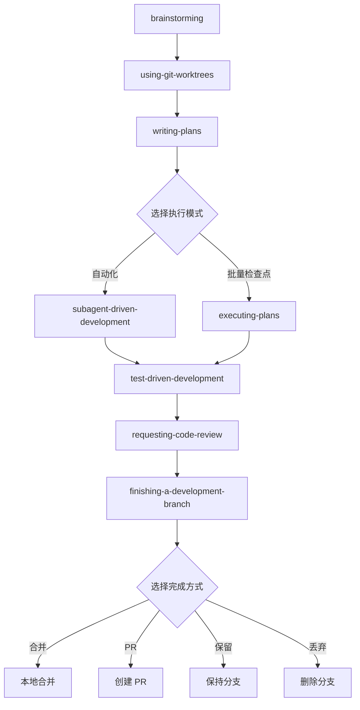
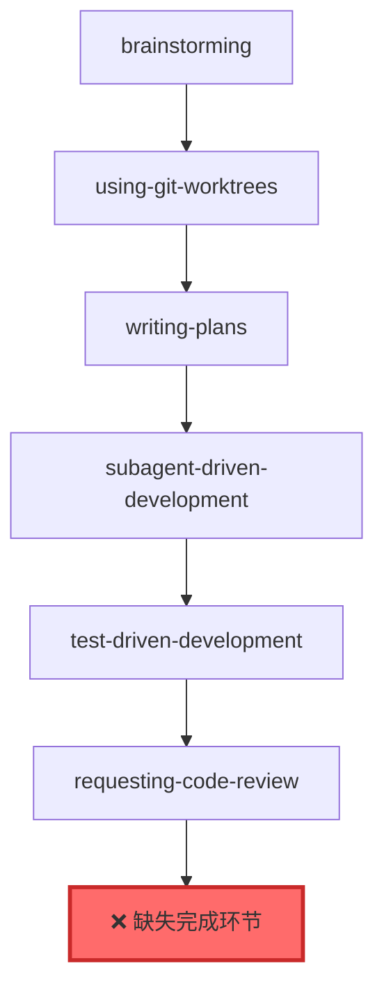

# Superpowers 完整集成分析报告

**生成时间**: 2026-02-17
**分析对象**: axiom-omc-integration vs https://github.com/obra/superpowers
**分析结论**: ❌ 未完整集成，完成度 71% (10/14)

---

## 📊 执行摘要

### 集成现状
- **已集成技能**: 10/14 (71%)
- **缺失核心技能**: 2 个（执行模式 + 完成流程）
- **缺失元技能**: 2 个（用户指南 + 开发指南）
- **工作流完整性**: ⚠️ 不完整（缺少标准化完成环节）

### 关键发现
1. ✅ 已集成的技能功能完整且质量良好
2. ❌ 缺少 `executing-plans` 和 `finishing-a-development-branch` 导致工作流不完整
3. ⚠️ `brainstorming` 技能实现差异较大，但都有效
4. ✅ 架构设计合理，易于扩展集成

### 建议行动
**立即**: 集成 executing-plans + finishing-a-development-branch
**短期**: 集成 using-superpowers + writing-skills
**长期**: 优化 brainstorming，与上游保持同步

---

## 📋 详细对比分析

### 1. 技能清单对比

| # | 技能名称 | Superpowers | Axiom-OMC | 状态 | 优先级 |
|---|---------|-------------|-----------|------|--------|
| 1 | brainstorming | ✅ | ✅ | ⚠️ 实现差异 | P2 |
| 2 | dispatching-parallel-agents | ✅ | ✅ | ✅ 已集成 | - |
| 3 | **executing-plans** | ✅ | ❌ | ❌ 缺失 | **P0** |
| 4 | **finishing-a-development-branch** | ✅ | ❌ | ❌ 缺失 | **P0** |
| 5 | receiving-code-review | ✅ | ✅ | ✅ 已集成 | - |
| 6 | requesting-code-review | ✅ | ✅ | ✅ 已集成 | - |
| 7 | subagent-driven-development | ✅ | ✅ | ✅ 已集成 | - |
| 8 | systematic-debugging | ✅ | ✅ | ✅ 已集成 | - |
| 9 | test-driven-development | ✅ | ✅ | ✅ 已集成 | - |
| 10 | using-git-worktrees | ✅ | ✅ | ✅ 已集成 | - |
| 11 | using-superpowers | ✅ | ❌ | ❌ 缺失 | P1 |
| 12 | verification-before-completion | ✅ | ✅ | ✅ 已集成 | - |
| 13 | writing-plans | ✅ | ✅ | ✅ 已集成 | - |
| 14 | writing-skills | ✅ | ❌ | ❌ 缺失 | P1 |

**优先级说明**:
- **P0**: 必须立即集成（核心工作流）
- **P1**: 建议短期集成（用户体验和扩展性）
- **P2**: 可选优化（融合改进）

---

## 🔍 缺失技能详细分析

### 1. executing-plans（P0 - 必须集成）

#### 功能描述
批量执行实现计划，带检查点审查。提供与 `subagent-driven-development` 不同的执行模式。

#### 核心特性
- **批量执行**: 默认每次执行 3 个任务
- **检查点审查**: 每批完成后报告并等待反馈
- **计划驱动**: 严格按照计划步骤执行
- **停止机制**: 遇到阻塞立即停止并寻求帮助

#### 工作流位置
```
writing-plans → executing-plans → finishing-a-development-branch
```

#### 依赖关系
- **前置**: `writing-plans` 生成的计划文件
- **调用**: `finishing-a-development-branch` 完成工作
- **配合**: `using-git-worktrees` 隔离环境

#### 与现有系统的关系
- **补充**: 为 `subagent-driven-development` 提供替代执行模式
- **选择**: 用户可以选择"自动化执行"或"批量检查点执行"
- **完整**: 补全工作流的执行环节

#### 集成难度
⭐⭐ (中等)
- 需要读取计划文件
- 需要任务状态管理
- 需要与 TodoWrite 集成
- 需要调用 finishing-a-development-branch

#### 预估工作量
- 复制和本地化: 2-3 小时
- 测试和验证: 2-3 小时
- 文档更新: 1 小时
- **总计**: 5-7 小时

---

### 2. finishing-a-development-branch（P0 - 必须集成）

#### 功能描述
标准化分支完成流程，提供清晰的选项并处理选择的工作流。

#### 核心特性
- **测试验证**: 在提供选项前验证测试通过
- **4 个标准选项**:
  1. 本地合并到基础分支
  2. 推送并创建 PR
  3. 保持分支不变
  4. 丢弃工作（需确认）
- **自动清理**: 根据选项自动清理 worktree
- **安全机制**: 丢弃前需要明确确认

#### 工作流位置
```
[executing-plans OR subagent-driven-development] → finishing-a-development-branch
```

#### 依赖关系
- **被调用**: `executing-plans` 和 `subagent-driven-development`
- **配合**: `using-git-worktrees` 清理工作区
- **工具**: Git 命令、测试命令、gh CLI

#### 与现有系统的关系
- **终点**: 所有开发工作流的标准化终点
- **必需**: 当前工作流缺少这个关键环节
- **标准化**: 提供一致的分支完成体验

#### 集成难度
⭐⭐⭐ (中等偏高)
- 需要 Git 操作（merge, push, branch -d）
- 需要测试执行和验证
- 需要 worktree 清理逻辑
- 需要用户交互和确认

#### 预估工作量
- 复制和本地化: 3-4 小时
- Git 操作测试: 2-3 小时
- 用户交互测试: 1-2 小时
- 文档更新: 1 小时
- **总计**: 7-10 小时

---

### 3. using-superpowers（P1 - 建议集成）

#### 功能描述
向用户介绍 Superpowers 技能系统的使用方法。

#### 核心特性
- 技能系统概述
- 自动触发机制说明
- 常见工作流示例
- 技能调用方式

#### 集成价值
- ⭐⭐⭐ 提升用户体验
- 降低学习曲线
- 提供快速入门指南

#### 集成难度
⭐ (简单)
- 主要是文档性内容
- 需要适配 Axiom-OMC 的架构说明

#### 预估工作量
- 复制和本地化: 1-2 小时
- 适配 Axiom-OMC: 1-2 小时
- **总计**: 2-4 小时

---

### 4. writing-skills（P1 - 建议集成）

#### 功能描述
遵循最佳实践创建和测试新技能的指南。

#### 核心特性
- 技能结构规范
- 命名约定
- 测试方法
- 最佳实践

#### 集成价值
- ⭐⭐⭐ 支持自定义技能开发
- 标准化技能创建流程
- 提升扩展性

#### 集成难度
⭐ (简单)
- 主要是指南性内容
- 需要适配 Axiom-OMC 的技能系统

#### 预估工作量
- 复制和本地化: 1-2 小时
- 适配 Axiom-OMC: 1-2 小时
- **总计**: 2-4 小时

---

## 🔄 工作流完整性分析

### Superpowers 标准工作流



### Axiom-OMC 当前工作流



### 关键缺口

1. **缺少执行模式选择**
   - 当前只有 `subagent-driven-development`
   - 缺少 `executing-plans` 作为替代

2. **缺少标准化完成流程**
   - 当前没有 `finishing-a-development-branch`
   - 用户需要手动处理分支合并/PR/清理

3. **工作流不完整**
   - 无法端到端完成开发任务
   - 缺少最后的"完成"环节

---

## 📐 实现差异分析

### brainstorming 技能对比

#### Superpowers 版本
- **大小**: 4690 字节
- **核心理念**: 协作对话 + 设计验证
- **流程**: 6 步（探索上下文 → 提问 → 提议方案 → 呈现设计 → 写文档 → 调用 writing-plans）
- **特色**:
  - 强调"方案对比"（2-3 个方案 + 权衡）
  - 强调"渐进式验证"（分段呈现设计）
  - 强调"YAGNI"（无情删除不必要功能）
- **HARD-GATE**: 不实现直到设计批准

#### Axiom-OMC 版本
- **大小**: 14KB+
- **核心理念**: 需求澄清 + 假设验证
- **流程**: 4 阶段（理解需求 → 澄清假设 → 验证理解 → 生成规格）
- **特色**:
  - 强调"假设识别"（显式列出假设）
  - 强调"验证问题"（确认理解正确）
  - 强调"规格完整性"（详细的验收标准）
- **强制要求**: 不实现直到需求澄清

#### 对比评估

| 维度 | Superpowers | Axiom-OMC | 评估 |
|------|-------------|-----------|------|
| 核心目标 | 设计探索 | 需求澄清 | 侧重点不同 |
| 方法论 | 方案对比 | 假设验证 | 都有效 |
| 输出 | 设计文档 | 需求规格 | 都完整 |
| 门禁 | 设计批准 | 需求确认 | 理念一致 |
| 详细程度 | 中等 | 详细 | 本地版更详细 |

#### 建议
- **保留**: Axiom-OMC 版本的详细内容和假设验证机制
- **补充**: Superpowers 的"方案对比"环节（2-3 个方案 + 权衡）
- **融合**: 结合两者优点，形成更完整的设计流程

---

## 🏗️ 集成策略

### 总体原则

1. **保持架构优势**
   - 保留 Axiom-OMC 的 Agent 系统
   - 保留状态管理和同步机制
   - 保留记忆系统和工作流整合

2. **补充工作流完整性**
   - 集成缺失的核心技能
   - 完善端到端工作流
   - 提供标准化流程

3. **融合最佳实践**
   - 强制门禁（HARD-GATE）
   - 自动触发机制
   - 两阶段审查

### 集成路径

#### 阶段 1: 核心技能集成（P0，1-2 天）

**目标**: 完成工作流，实现端到端开发

**任务**:
1. 集成 `executing-plans`
   - 复制 SKILL.md 到 `skills/executing-plans/`
   - 本地化翻译（中文）
   - 适配 Axiom-OMC 的任务系统
   - 测试批量执行流程

2. 集成 `finishing-a-development-branch`
   - 复制 SKILL.md 到 `skills/finishing-a-development-branch/`
   - 本地化翻译（中文）
   - 测试 Git 操作和 worktree 清理
   - 测试 4 个完成选项

3. 端到端测试
   - 测试完整工作流：brainstorming → ... → finishing
   - 验证技能调用关系
   - 验证状态管理

**验收标准**:
- [ ] 两个技能文件已创建
- [ ] 中文翻译完成
- [ ] 完整工作流可以执行
- [ ] 所有测试通过

#### 阶段 2: 元技能集成（P1，1 天）

**目标**: 提升用户体验和扩展性

**任务**:
1. 集成 `using-superpowers`
   - 复制 SKILL.md 到 `skills/using-superpowers/`
   - 适配 Axiom-OMC 的架构说明
   - 更新技能列表和示例

2. 集成 `writing-skills`
   - 复制 SKILL.md 到 `skills/writing-skills/`
   - 适配 Axiom-OMC 的技能系统
   - 提供创建示例

**验收标准**:
- [ ] 两个技能文件已创建
- [ ] 文档适配完成
- [ ] 用户可以理解和使用

#### 阶段 3: 优化和融合（P2，2-3 天）

**目标**: 融合两个版本的优点，提升整体质量

**任务**:
1. 优化 `brainstorming`
   - 补充"方案对比"环节
   - 保留"假设验证"机制
   - 融合两者优点

2. 统一文档风格
   - 统一中英文使用
   - 统一格式和结构
   - 统一术语表

3. 性能优化
   - 技能加载优化
   - 状态同步优化
   - 测试覆盖率提升

**验收标准**:
- [ ] brainstorming 融合完成
- [ ] 文档风格统一
- [ ] 性能符合基准
- [ ] 测试覆盖率 > 90%

---

## 📊 风险评估

### 高风险

#### 1. 工作流不完整（当前状态）
- **影响**: 无法标准化完成开发任务
- **概率**: 100%（已存在）
- **缓解**: 立即集成 P0 技能

#### 2. Git 操作风险
- **影响**: 可能导致代码丢失或分支混乱
- **概率**: 中等
- **缓解**: 充分测试 Git 操作，提供回滚机制

### 中风险

#### 3. 状态同步复杂度
- **影响**: 技能状态与 Axiom-OMC 状态不一致
- **概率**: 中等
- **缓解**: 设计清晰的状态同步机制

#### 4. 中英文混合
- **影响**: 用户体验不一致
- **概率**: 高
- **缓解**: 制定统一的语言策略

### 低风险

#### 5. 性能开销
- **影响**: 技能加载和执行变慢
- **概率**: 低
- **缓解**: 性能测试和优化

#### 6. 维护成本
- **影响**: 需要同步 Superpowers 更新
- **概率**: 中等
- **缓解**: 建立定期同步机制

---

## ✅ 验证计划

### 功能验证

#### 1. 技能完整性
- [ ] 所有 14 个技能都已集成
- [ ] 每个技能的 SKILL.md 文件完整
- [ ] 技能描述和触发条件清晰

#### 2. 工作流完整性
- [ ] 完整工作流可以端到端执行
- [ ] 技能调用关系正确
- [ ] 状态转换正常

#### 3. 执行正确性
- [ ] executing-plans 可以批量执行任务
- [ ] finishing-a-development-branch 可以完成分支
- [ ] Git 操作正确无误
- [ ] worktree 清理正常

### 性能验证

#### 1. 加载性能
- [ ] 技能加载时间 < 100ms
- [ ] 技能文件解析正常
- [ ] 无内存泄漏

#### 2. 执行性能
- [ ] 工作流执行符合基准
- [ ] 状态同步开销可接受
- [ ] 并发执行正常

### 质量验证

#### 1. 文档质量
- [ ] 所有技能文档完整
- [ ] 中文翻译准确
- [ ] 示例清晰易懂

#### 2. 测试覆盖
- [ ] 单元测试覆盖率 > 90%
- [ ] 集成测试覆盖关键路径
- [ ] 端到端测试覆盖完整工作流

#### 3. 兼容性
- [ ] 无命令冲突
- [ ] 与现有系统兼容
- [ ] 向后兼容

---

## 📈 成功指标

### 短期指标（1-2 周）

1. **集成完成度**: 100% (14/14 技能)
2. **工作流完整性**: 100%（端到端可执行）
3. **测试覆盖率**: > 90%
4. **文档完整性**: 100%

### 中期指标（1-2 月）

1. **用户采用率**: > 80% 的开发任务使用完整工作流
2. **错误率**: < 5% 的工作流执行失败
3. **性能**: 所有操作符合性能基准
4. **满意度**: 用户反馈积极

### 长期指标（3-6 月）

1. **维护成本**: 与 Superpowers 保持同步
2. **扩展性**: 支持自定义技能开发
3. **稳定性**: 无重大 bug
4. **社区**: 活跃的用户和贡献者

---

## 🎯 行动计划

### 立即行动（本周）

1. **集成 executing-plans**
   - 负责人: [待分配]
   - 截止日期: [待定]
   - 优先级: P0

2. **集成 finishing-a-development-branch**
   - 负责人: [待分配]
   - 截止日期: [待定]
   - 优先级: P0

3. **端到端测试**
   - 负责人: [待分配]
   - 截止日期: [待定]
   - 优先级: P0

### 短期行动（下周）

4. **集成 using-superpowers**
   - 负责人: [待分配]
   - 截止日期: [待定]
   - 优先级: P1

5. **集成 writing-skills**
   - 负责人: [待分配]
   - 截止日期: [待定]
   - 优先级: P1

### 中期行动（本月）

6. **优化 brainstorming**
   - 负责人: [待分配]
   - 截止日期: [待定]
   - 优先级: P2

7. **统一文档风格**
   - 负责人: [待分配]
   - 截止日期: [待定]
   - 优先级: P2

8. **性能优化**
   - 负责人: [待分配]
   - 截止日期: [待定]
   - 优先级: P2

---

## 📚 参考资料

### Superpowers 官方资源
- **GitHub 仓库**: https://github.com/obra/superpowers
- **博客文章**: https://blog.fsck.com/2025/10/09/superpowers/
- **Marketplace**: https://github.com/obra/superpowers-marketplace

### Axiom-OMC 项目资源
- **README**: ./README.md
- **API 文档**: ./docs/API-REFERENCE.md
- **用户指南**: ./docs/USER-GUIDE.md
- **集成计划**: ./.claude/integration-plan.md

### 相关文档
- **上下文摘要**: ./.claude/context-summary-superpowers-integration.md
- **操作日志**: ./.claude/operations-log.md
- **对比分析**: ./SUPERPOWERS-COMPARISON.md

---

## 📝 附录

### A. 技能文件结构

```
skills/
├── brainstorming/
│   └── SKILL.md
├── dispatching-parallel-agents/
│   └── SKILL.md
├── executing-plans/              ← 待集成
│   └── SKILL.md
├── finishing-a-development-branch/ ← 待集成
│   └── SKILL.md
├── receiving-code-review/
│   └── SKILL.md
├── requesting-code-review/
│   └── SKILL.md
├── subagent-driven-development/
│   └── SKILL.md
├── systematic-debugging/
│   ├── SKILL.md
│   ├── condition-based-waiting.md
│   ├── defense-in-depth.md
│   └── root-cause-tracing.md
├── test-driven-development/
│   ├── SKILL.md
│   └── testing-anti-patterns.md
├── using-git-worktrees/
│   └── SKILL.md
├── using-superpowers/            ← 待集成
│   └── SKILL.md
├── verification-before-completion/
│   └── SKILL.md
├── writing-plans/
│   └── SKILL.md
└── writing-skills/               ← 待集成
    └── SKILL.md
```

### B. 技能元数据格式

```markdown
---
name: skill-name
description: Brief description of when to use this skill
---

# Skill Title

## Overview
...

## The Process
...

## Integration
...
```

### C. 集成检查清单

#### 技能文件
- [ ] SKILL.md 文件已创建
- [ ] 元数据（name, description）完整
- [ ] 中文翻译准确
- [ ] 格式符合规范

#### 功能实现
- [ ] 技能逻辑正确
- [ ] 与其他技能集成正常
- [ ] 状态管理正确
- [ ] 错误处理完善

#### 测试
- [ ] 单元测试编写
- [ ] 集成测试编写
- [ ] 端到端测试编写
- [ ] 所有测试通过

#### 文档
- [ ] README 更新
- [ ] API 文档更新
- [ ] 用户指南更新
- [ ] 示例代码提供

---

**报告结束**

如有疑问或需要进一步分析，请参考上下文摘要文件或联系项目维护者。
