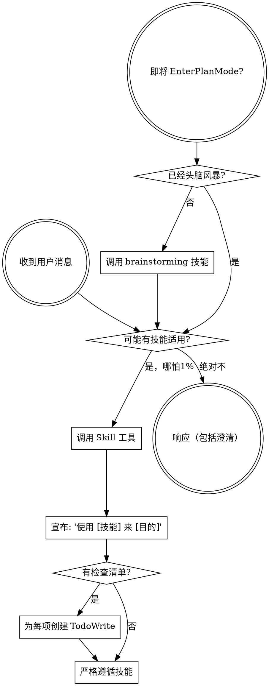

<EXTREMELY-IMPORTANT>
如果你认为某个技能有哪怕 1% 的可能性适用于你正在做的事情，你绝对必须调用该技能。

如果一个技能适用于你的任务，你没有选择。你必须使用它。

这不可协商。这不是可选的。你无法合理化逃避这一点。
</EXTREMELY-IMPORTANT>

## 如何访问技能

**在 Claude Code 中**: 使用 `Skill` 工具。当你调用一个技能时，其内容会被加载并呈现给你——直接遵循它。永远不要在技能文件上使用 Read 工具。

**在其他环境中**: 查看你的平台文档了解如何加载技能。

# 使用技能

## 规则

**在任何响应或操作之前调用相关或请求的技能。** 即使只有 1% 的可能性某个技能可能适用，也意味着你应该调用该技能进行检查。如果调用的技能结果不适合当前情况，你不需要使用它。

## 危险信号

这些想法意味着停止——你在合理化：

| 想法 | 现实 |
|------|------|
| "这只是一个简单的问题" | 问题就是任务。检查技能。 |
| "我需要先了解更多上下文" | 技能检查在澄清问题之前。 |
| "让我先探索代码库" | 技能告诉你如何探索。先检查。 |
| "我可以快速检查 git/文件" | 文件缺少对话上下文。检查技能。 |
| "让我先收集信息" | 技能告诉你如何收集信息。 |
| "这不需要正式的技能" | 如果技能存在，就使用它。 |
| "我记得这个技能" | 技能会演变。阅读当前版本。 |
| "这不算任务" | 行动 = 任务。检查技能。 |
| "技能太过了" | 简单的事情会变复杂。使用它。 |
| "我先做这一件事" | 在做任何事之前检查。 |
| "这感觉很有成效" | 无纪律的行动浪费时间。技能防止这种情况。 |
| "我知道那是什么意思" | 知道概念 ≠ 使用技能。调用它。 |

## 技能优先级

当多个技能可能适用时，使用此顺序：

1. **流程技能优先**（brainstorming, debugging）- 这些决定如何处理任务
2. **实现技能其次**（frontend-design, mcp-builder）- 这些指导执行

"让我们构建 X" → 先 brainstorming，然后实现技能。
"修复这个 bug" → 先 debugging，然后特定领域技能。

## 技能类型

**严格型**（TDD, debugging）：严格遵循。不要适应掉纪律。

**灵活型**（patterns）：根据上下文调整原则。

技能本身会告诉你是哪种。

## 用户指令

指令说明做什么（WHAT），而不是如何做（HOW）。"添加 X" 或 "修复 Y" 不意味着跳过工作流。
