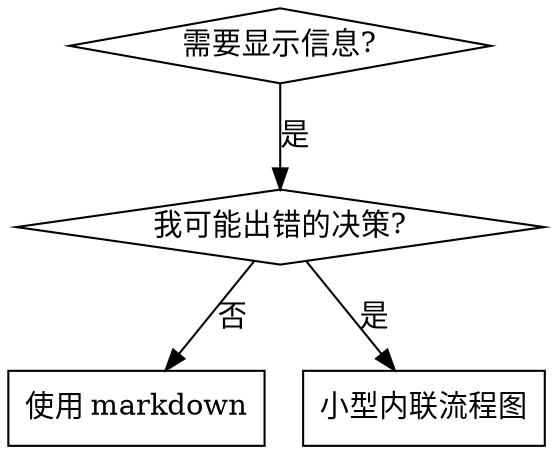

# 编写技能

## 概述

**编写技能就是将测试驱动开发应用于流程文档。**

**个人技能存放在特定于代理的目录中（Claude Code 为 `~/.claude/skills`，Codex 为 `~/.agents/skills/`）**

你编写测试用例（使用子代理的压力场景），观察它们失败（基线行为），编写技能（文档），观察测试通过（代理遵守），然后重构（堵住漏洞）。

**核心原则**：如果你没有观察到代理在没有技能的情况下失败，你就不知道技能是否教授了正确的东西。

**必需背景**：在使用此技能之前，你必须理解 superpowers:test-driven-development。该技能定义了基本的 RED-GREEN-REFACTOR 循环。本技能将 TDD 应用于文档。

**官方指南**：有关 Anthropic 的官方技能编写最佳实践，请参阅 anthropic-best-practices.md。本文档提供了补充本技能中 TDD 重点方法的额外模式和指南。

## 什么是技能？

**技能**是经过验证的技术、模式或工具的参考指南。技能帮助未来的 Claude 实例找到并应用有效的方法。

**技能是**：可重用的技术、模式、工具、参考指南

**技能不是**：关于你如何解决一次问题的叙述

## TDD 映射到技能创建

| TDD 概念 | 技能创建 |
|----------|----------|
| **测试用例** | 使用子代理的压力场景 |
| **生产代码** | 技能文档（SKILL.md）|
| **测试失败（RED）** | 代理在没有技能的情况下违反规则（基线）|
| **测试通过（GREEN）** | 代理在有技能的情况下遵守 |
| **重构** | 在保持合规的同时堵住漏洞 |
| **先写测试** | 在编写技能之前运行基线场景 |
| **观察失败** | 记录代理使用的确切合理化理由 |
| **最小代码** | 编写针对这些特定违规的技能 |
| **观察通过** | 验证代理现在遵守 |
| **重构循环** | 发现新的合理化理由 → 堵住 → 重新验证 |

整个技能创建过程遵循 RED-GREEN-REFACTOR。

## 何时创建技能

**创建时机**：
- 技术对你来说不是直观明显的
- 你会在多个项目中再次引用它
- 模式广泛适用（不是项目特定的）
- 其他人会受益

**不要创建**：
- 一次性解决方案
- 其他地方已有良好文档的标准实践
- 项目特定的约定（放在 CLAUDE.md 中）
- 机械约束（如果可以用正则表达式/验证强制执行，就自动化它——为判断调用保留文档）

## 技能类型

### 技术（Technique）
具有遵循步骤的具体方法（condition-based-waiting, root-cause-tracing）

### 模式（Pattern）
思考问题的方式（flatten-with-flags, test-invariants）

### 参考（Reference）
API 文档、语法指南、工具文档（office docs）

## 目录结构

```
skills/
  skill-name/
    SKILL.md              # 主要参考（必需）
    supporting-file.*     # 仅在需要时
```

**扁平命名空间** - 所有技能在一个可搜索的命名空间中

**单独文件用于**：
1. **重量级参考**（100+ 行）- API 文档、综合语法
2. **可重用工具** - 脚本、实用程序、模板

**保持内联**：
- 原则和概念
- 代码模式（< 50 行）
- 其他所有内容

## SKILL.md 结构

**前置元数据（YAML）**：
- 仅支持两个字段：`name` 和 `description`
- 总共最多 1024 个字符
- `name`：仅使用字母、数字和连字符（无括号、特殊字符）
- `description`：第三人称，仅描述何时使用（不是它做什么）
  - 以 "Use when..." 开头，专注于触发条件
  - 包括具体症状、情况和上下文
  - **永远不要总结技能的流程或工作流**（参见 CSO 部分了解原因）
  - 如果可能，保持在 500 个字符以下

```markdown
---
name: Skill-Name-With-Hyphens
description: Use when [specific triggering conditions and symptoms]
---

# 技能名称

## 概述
这是什么？用 1-2 句话说明核心原则。

## 何时使用
[如果决策不明显，使用小型内联流程图]

带有症状和用例的项目符号列表
何时不使用

## 核心模式（用于技术/模式）
前后代码对比

## 快速参考
用于扫描常见操作的表格或项目符号

## 实现
简单模式的内联代码
重量级参考或可重用工具的链接到文件

## 常见错误
出错的地方 + 修复

## 实际影响（可选）
具体结果
```

## Claude 搜索优化（CSO）

**对发现至关重要**：未来的 Claude 需要找到你的技能

### 1. 丰富的描述字段

**目的**：Claude 读取描述以决定为给定任务加载哪些技能。让它回答："我现在应该阅读这个技能吗？"

**格式**：以 "Use when..." 开头，专注于触发条件

**关键：描述 = 何时使用，而不是技能做什么**

描述应该只描述触发条件。不要在描述中总结技能的流程或工作流。

**为什么这很重要**：测试表明，当描述总结技能的工作流时，Claude 可能会遵循描述而不是阅读完整的技能内容。一个说"任务之间的代码审查"的描述导致 Claude 只做一次审查，即使技能的流程图清楚地显示了两次审查（规范合规性然后代码质量）。

当描述更改为只是"在执行具有独立任务的实现计划时使用"（无工作流摘要）时，Claude 正确地阅读了流程图并遵循了两阶段审查过程。

**陷阱**：总结工作流的描述创建了 Claude 会采取的捷径。技能主体变成了 Claude 跳过的文档。

```yaml
# ❌ 错误：总结工作流 - Claude 可能会遵循这个而不是阅读技能
description: Use when executing plans - dispatches subagent per task with code review between tasks

# ❌ 错误：太多流程细节
description: Use for TDD - write test first, watch it fail, write minimal code, refactor

# ✅ 正确：只有触发条件，无工作流摘要
description: Use when executing implementation plans with independent tasks in the current session

# ✅ 正确：仅触发条件
description: Use when implementing any feature or bugfix, before writing implementation code
```

**内容**：
- 使用具体的触发器、症状和表明此技能适用的情况
- 描述*问题*（竞态条件、不一致行为）而不是*特定语言的症状*（setTimeout, sleep）
- 保持触发器与技术无关，除非技能本身是特定于技术的
- 如果技能是特定于技术的，在触发器中明确说明
- 以第三人称书写（注入到系统提示中）
- **永远不要总结技能的流程或工作流**

```yaml
# ❌ 错误：太抽象、模糊，不包括何时使用
description: For async testing

# ❌ 错误：第一人称
description: I can help you with async tests when they're flaky

# ❌ 错误：提到技术但技能不是特定于它的
description: Use when tests use setTimeout/sleep and are flaky

# ✅ 正确：以 "Use when" 开头，描述问题，无工作流
description: Use when tests have race conditions, timing dependencies, or pass/fail inconsistently

# ✅ 正确：特定于技术的技能，明确触发器
description: Use when using React Router and handling authentication redirects
```

### 2. 关键词覆盖

使用 Claude 会搜索的词：
- 错误消息："Hook timed out"、"ENOTEMPTY"、"race condition"
- 症状："flaky"、"hanging"、"zombie"、"pollution"
- 同义词："timeout/hang/freeze"、"cleanup/teardown/afterEach"
- 工具：实际命令、库名称、文件类型

### 3. 描述性命名

**使用主动语态、动词优先**：
- ✅ `creating-skills` 而不是 `skill-creation`
- ✅ `condition-based-waiting` 而不是 `async-test-helpers`

### 4. Token 效率（关键）

**问题**：getting-started 和频繁引用的技能加载到每个对话中。每个 token 都很重要。

**目标字数**：
- getting-started 工作流：每个 <150 字
- 频繁加载的技能：总共 <200 字
- 其他技能：<500 字（仍然要简洁）

**技术**：

**将细节移到工具帮助中**：
```bash
# ❌ 错误：在 SKILL.md 中记录所有标志
search-conversations supports --text, --both, --after DATE, --before DATE, --limit N

# ✅ 正确：引用 --help
search-conversations supports multiple modes and filters. Run --help for details.
```

**使用交叉引用**：
```markdown
# ❌ 错误：重复工作流细节
When searching, dispatch subagent with template...
[20 行重复的指令]

# ✅ 正确：引用其他技能
Always use subagents (50-100x context savings). REQUIRED: Use [other-skill-name] for workflow.
```

**压缩示例**：
```markdown
# ❌ 错误：冗长的示例（42 字）
your human partner: "How did we handle authentication errors in React Router before?"
You: I'll search past conversations for React Router authentication patterns.
[Dispatch subagent with search query: "React Router authentication error handling 401"]

# ✅ 正确：最小示例（20 字）
Partner: "How did we handle auth errors in React Router?"
You: Searching...
[Dispatch subagent → synthesis]
```

**消除冗余**：
- 不要重复交叉引用技能中的内容
- 不要解释从命令中显而易见的内容
- 不要包含同一模式的多个示例

**验证**：
```bash
wc -w skills/path/SKILL.md
# getting-started 工作流：目标 <150 每个
# 其他频繁加载：目标 <200 总共
```

**按你做什么或核心洞察命名**：
- ✅ `condition-based-waiting` > `async-test-helpers`
- ✅ `using-skills` 而不是 `skill-usage`
- ✅ `flatten-with-flags` > `data-structure-refactoring`
- ✅ `root-cause-tracing` > `debugging-techniques`

**动名词（-ing）适用于流程**：
- `creating-skills`、`testing-skills`、`debugging-with-logs`
- 主动，描述你正在采取的行动

### 4. 交叉引用其他技能

**在编写引用其他技能的文档时**：

仅使用技能名称，带有明确的要求标记：
- ✅ 好：`**REQUIRED SUB-SKILL:** Use superpowers:test-driven-development`
- ✅ 好：`**REQUIRED BACKGROUND:** You MUST understand superpowers:systematic-debugging`
- ❌ 坏：`See skills/testing/test-driven-development`（不清楚是否必需）
- ❌ 坏：`@skills/testing/test-driven-development/SKILL.md`（强制加载，消耗上下文）

**为什么没有 @ 链接**：`@` 语法立即强制加载文件，在你需要它们之前消耗 200k+ 上下文。

## 流程图使用



**仅在以下情况使用流程图**：
- 不明显的决策点
- 你可能过早停止的流程循环
- "何时使用 A vs B" 的决策

**永远不要在以下情况使用流程图**：
- 参考材料 → 表格、列表
- 代码示例 → Markdown 块
- 线性指令 → 编号列表
- 没有语义意义的标签（step1, helper2）

有关 graphviz 样式规则，请参阅 @graphviz-conventions.dot。

**为你的人类伙伴可视化**：使用此目录中的 `render-graphs.js` 将技能的流程图渲染为 SVG：
```bash
./render-graphs.js ../some-skill           # 每个图表单独
./render-graphs.js ../some-skill --combine # 所有图表在一个 SVG 中
```

## 代码示例

**一个优秀的示例胜过许多平庸的示例**

选择最相关的语言：
- 测试技术 → TypeScript/JavaScript
- 系统调试 → Shell/Python
- 数据处理 → Python

**好的示例**：
- 完整且可运行
- 有良好的注释解释为什么
- 来自真实场景
- 清楚地显示模式
- 准备好适应（不是通用模板）

**不要**：
- 用 5+ 种语言实现
- 创建填空模板
- 编写人为的示例

你擅长移植 - 一个好的示例就足够了。

## 文件组织

### 自包含技能
```
defense-in-depth/
  SKILL.md    # 所有内容内联
```
何时：所有内容都适合，不需要重量级参考

### 带有可重用工具的技能
```
condition-based-waiting/
  SKILL.md    # 概述 + 模式
  example.ts  # 要适应的工作助手
```
何时：工具是可重用的代码，而不仅仅是叙述

### 带有重量级参考的技能
```
pptx/
  SKILL.md       # 概述 + 工作流
  pptxgenjs.md   # 600 行 API 参考
  ooxml.md       # 500 行 XML 结构
  scripts/       # 可执行工具
```
何时：参考材料太大而无法内联

## 铁律（与 TDD 相同）

```
没有失败的测试就没有技能
```

这适用于新技能和对现有技能的编辑。

在测试之前编写技能？删除它。重新开始。
在没有测试的情况下编辑技能？同样的违规。

**没有例外**：
- 不适用于"简单添加"
- 不适用于"只是添加一个部分"
- 不适用于"文档更新"
- 不要将未经测试的更改保留为"参考"
- 不要在运行测试时"适应"
- 删除意味着删除

**必需背景**：superpowers:test-driven-development 技能解释了为什么这很重要。相同的原则适用于文档。

## 测试所有技能类型

不同的技能类型需要不同的测试方法：

### 纪律执行技能（规则/要求）

**示例**：TDD, verification-before-completion, designing-before-coding

**测试方法**：
- 学术问题：他们理解规则吗？
- 压力场景：他们在压力下遵守吗？
- 多重压力组合：时间 + 沉没成本 + 疲惫
- 识别合理化理由并添加明确的反驳

**成功标准**：代理在最大压力下遵循规则

### 技术技能（操作指南）

**示例**：condition-based-waiting, root-cause-tracing, defensive-programming

**测试方法**：
- 应用场景：他们能正确应用技术吗？
- 变化场景：他们处理边缘情况吗？
- 缺失信息测试：指令有缺口吗？

**成功标准**：代理成功将技术应用于新场景

### 模式技能（心智模型）

**示例**：reducing-complexity, information-hiding concepts

**测试方法**：
- 识别场景：他们识别模式何时适用吗？
- 应用场景：他们能使用心智模型吗？
- 反例：他们知道何时不应用吗？

**成功标准**：代理正确识别何时/如何应用模式

### 参考技能（文档/API）

**示例**：API 文档、命令参考、库指南

**测试方法**：
- 检索场景：他们能找到正确的信息吗？
- 应用场景：他们能正确使用找到的内容吗？
- 缺口测试：常见用例是否涵盖？

**成功标准**：代理找到并正确应用参考信息

## 跳过测试的常见合理化理由

| 借口 | 现实 |
|------|------|
| "技能显然很清楚" | 对你清楚 ≠ 对其他代理清楚。测试它。 |
| "这只是一个参考" | 参考可能有缺口、不清楚的部分。测试检索。 |
| "我只是添加一个小部分" | 小更改可能破坏现有行为。测试它。 |
| "这是文档，不是代码" | 文档也有 bug。测试它。 |
| "我会稍后测试" | 稍后 = 永远不会。现在测试。 |
| "测试会花太长时间" | 修复未经测试的技能花费更长时间。 |

## 测试工作流

### 阶段 1：基线（RED）

**目标**：在没有技能的情况下观察代理失败

1. **创建压力场景**
   - 设计一个代理应该使用技能的情况
   - 包括会诱使代理跳过技能的压力
   - 使其具体且可重现

2. **运行基线测试**
   - 在没有技能的情况下启动子代理
   - 观察它如何失败
   - 记录确切的合理化理由
   - 记录它做错了什么

3. **记录失败**
   ```markdown
   ## 基线行为（无技能）

   场景：[描述]

   代理做了什么：
   - [具体行为]

   合理化理由：
   - "[确切引用]"
   - "[确切引用]"

   为什么这是错误的：
   - [解释]
   ```

### 阶段 2：编写技能（GREEN）

**目标**：编写针对观察到的失败的技能

1. **针对合理化理由**
   - 为每个合理化理由添加明确的反驳
   - 使用代理的确切措辞
   - 解释为什么合理化理由是错误的

2. **提供具体指导**
   - 不要说"要小心" - 说"做 X"
   - 不要说"考虑 Y" - 说"检查 Y"
   - 使指令可操作

3. **保持最小化**
   - 只写足以通过测试的内容
   - 不要添加"可能有用"的额外内容
   - 专注于观察到的失败

4. **运行测试**
   - 使用技能启动子代理
   - 使用相同的压力场景
   - 验证代理现在遵守

### 阶段 3：重构（REFACTOR）

**目标**：堵住漏洞，同时保持合规

1. **寻找新的合理化理由**
   - 运行变化场景
   - 尝试不同的压力
   - 寻找代理仍然失败的方式

2. **堵住漏洞**
   - 为新的合理化理由添加反驳
   - 澄清模糊的指令
   - 添加边缘情况

3. **重新验证**
   - 重新运行所有测试
   - 确保旧测试仍然通过
   - 确保新测试现在通过

4. **重复**
   - 继续直到你找不到更多的合理化理由
   - 继续直到代理在所有场景中遵守

## 使用子代理测试

**为什么使用子代理**：
- 隔离测试环境
- 新鲜的上下文（无历史记录）
- 可重现的结果
- 可以并行运行多个测试

**测试设置**：
```markdown
测试：[技能名称] - [场景描述]

场景：
[具体情况]

压力：
- [压力因素 1]
- [压力因素 2]

预期行为：
[代理应该做什么]

实际行为：
[代理做了什么]

通过/失败：[状态]
```

**运行测试**：
1. 启动子代理（使用或不使用技能）
2. 提供场景
3. 观察行为
4. 记录结果
5. 比较有/无技能

有关详细的测试工作流，请参阅 testing-skills-with-subagents.md。

## 说服原则

技能是说服文档 - 你正在说服未来的 Claude 实例采取特定行动。

有关有效说服技术，请参阅 persuasion-principles.md。

关键原则：
- **具体性**：使用具体示例，而不是抽象原则
- **对比**：显示前后对比
- **权威**：引用真实结果和经验
- **社会证明**：显示其他人如何使用它
- **稀缺性**：强调不使用的成本

## 常见错误

### 1. 在测试之前编写

**症状**：你有一个技能但没有失败的测试

**修复**：删除技能。运行基线。重新开始。

### 2. 测试你的实现，而不是技能

**症状**：你测试代码是否工作，而不是代理是否遵守

**修复**：测试代理行为，而不是代码正确性

### 3. 通用压力场景

**症状**："测试代理是否使用 TDD"

**修复**：具体："在时间压力下实现登录功能"

### 4. 跳过基线

**症状**：你假设代理会失败

**修复**：实际运行基线。你可能会感到惊讶。

### 5. 添加未经测试的"改进"

**症状**："我只是添加这个有用的部分"

**修复**：删除它。如果它有用，写一个测试证明它。

### 6. 保留失败的测试

**症状**："技能大部分工作，只是这一个测试失败"

**修复**：修复技能或删除测试。没有中间地带。

### 7. 在描述中总结工作流

**症状**：描述说"做 X 然后 Y"

**修复**：描述只说"何时使用"，而不是"做什么"

## 技能演变

技能不是静态的。它们随着你学习而演变。

**何时更新技能**：
- 你发现新的合理化理由
- 你发现更好的方法
- 你发现缺失的边缘情况
- 你发现模糊的指令

**如何更新**：
1. 运行当前测试（确保它们仍然通过）
2. 创建新的失败测试（针对新问题）
3. 更新技能（针对新失败）
4. 验证所有测试通过
5. 重构（如果需要）

**不要**：
- 在没有测试的情况下更新
- 破坏现有测试
- 添加未经验证的"改进"

## 技能退役

有时技能变得过时。

**何时退役**：
- 技术已弃用
- 更好的方法出现
- 技能被其他技能取代
- 没有人使用它

**如何退役**：
1. 添加弃用通知到技能
2. 指向替代品
3. 设置删除日期
4. 在日期后删除

**不要**：
- 悄悄删除
- 留下损坏的引用
- 删除仍在使用的技能

## 检查清单

在发布技能之前：

- [ ] 有失败的基线测试
- [ ] 技能针对观察到的失败
- [ ] 所有测试通过
- [ ] 描述只说"何时使用"
- [ ] 名称是描述性的
- [ ] 关键词覆盖良好
- [ ] 交叉引用清晰
- [ ] 代码示例完整
- [ ] 流程图（如果需要）清晰
- [ ] 没有未经测试的"改进"
- [ ] Token 效率良好（<500 字）
- [ ] 在压力下测试
- [ ] 记录合理化理由
- [ ] 提供具体指导

## 示例

有关完整的示例技能，请参阅 examples/ 目录。

每个示例包括：
- 完整的 SKILL.md
- 基线测试结果
- 测试场景
- 合理化理由记录
- 重构历史

## 总结

编写技能 = TDD 应用于文档

1. **RED**：观察代理在没有技能的情况下失败
2. **GREEN**：编写针对失败的技能
3. **REFACTOR**：堵住漏洞，保持合规

**铁律**：没有失败的测试就没有技能

**关键原则**：
- 测试优先，总是
- 具体，不抽象
- 最小化，不过度
- 针对合理化理由
- 验证合规
- 持续重构

**记住**：如果你没有观察到代理失败，你不知道技能是否教授了正确的东西。